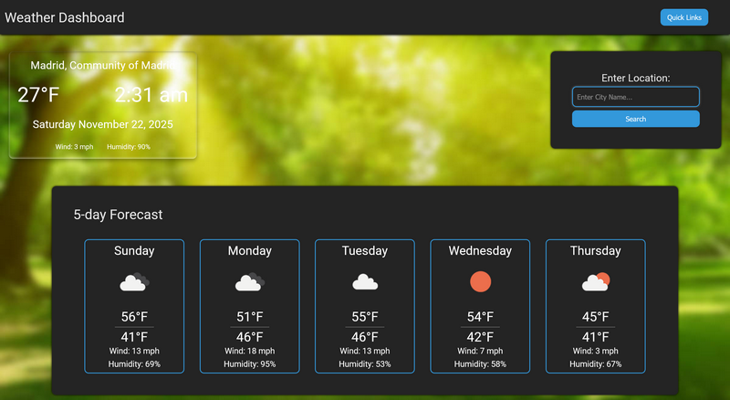
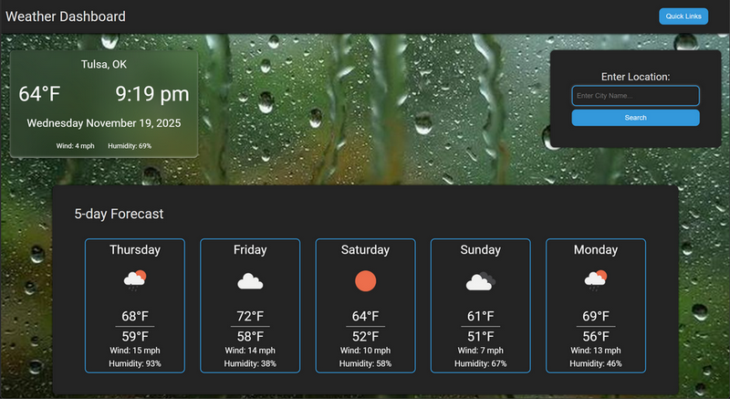
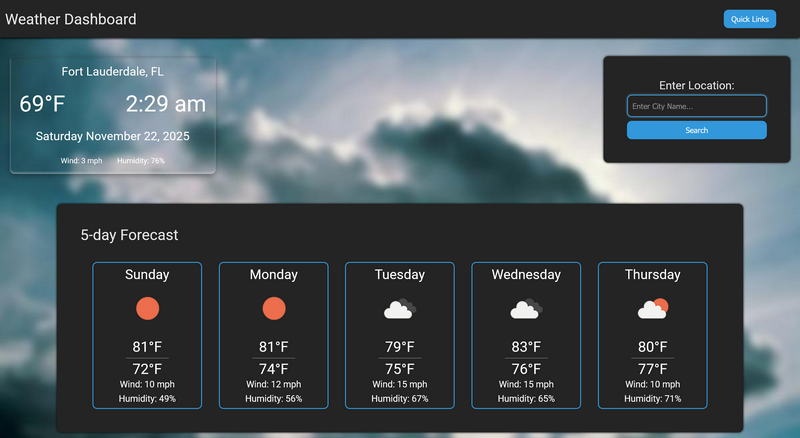

# Weather Application

## Description

A weather application that allows you to find the weather anywhere in the world. Look for current weather and a 5day forecast. This is to help you get the info you need in a quick and timely manner. This page was made as a project from the Full Stack Developers Bootcamp.

## Features

- You can search for any city you want
- You can use the quick links to pick a recent city you viewed
- The background changes depending on the weather in the area
- Page will load the last city you recently searched for from quick links
- Time Displayed is the user's current time

## Deployed Link

Deployed Link: [Aaron Primmer's Weather Application](https://aaronprimmer.github.io/week6-Challenge/)

## Screenshots

## Technologies Used

- HTML5
- CSS3
- Javascript / JQuery
- OpenWeatherMap API
- Day.js

## Installation

1. Clone the repository
2. Open the index.html file in your browser
3. Style however you would like

## How to use

1. The page loads a default city
2. Search for the city of your choosing
3. View current conidtions and the 5 day forecast
4. Use the quick links to display a city that was recently viewed

## Future Enhancements

- Display the time from the timezone that the city is in
- Load the user's nearby city information on startup
-

## Resources

- [MDN Documentation](https://developer.mozilla.org/en-US/docs/Web/JavaScript)
- [Open Weather Map Documentation](https://openweathermap.org/api)
- [Day.js Documentation](https://day.js.org/docs/en/installation/browser)

## Contact

Created by Aaron Primmer

- LinkedIn: [https://www.linkedin.com/in/aaron-primmer-670991268/](https://www.linkedin.com/in/aaron-primmer-670991268/)
- Email: [aaronmprimmer@hotmail.com](mailto:aaronmprimmer@hotmail.com)

### Hope you enjoy!
